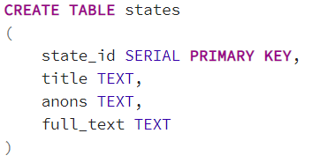

# HelloWorld
Запрос /info сообщает о типе компоненты (list or database).
Этот тип можно сменить запросом /change с передачей желаемого типа в аргументах.
Параметры для работы с базой данных указываются в соответствующих константах класса StateServiceDatabaseImpl(строки 13-16).
Структура текщей базы данных содержит одну таблицу articles, вида:

